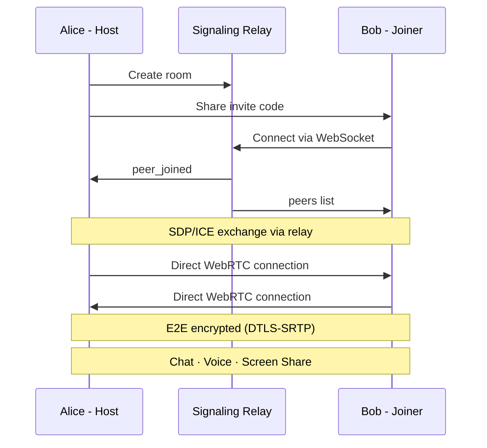

<p align="center">
  
</p>

# Comms

> P2P voice + text chat. End-to-end encrypted. No servers required.

[](https://github.com/seppulcro/comms/releases)
[](https://github.com/seppulcro/comms/actions)
[](./LICENSE)

A FOSS Discord alternative that runs entirely peer-to-peer. Host a room from
your desktop app — others join with an invite code. All communication flows
directly between peers via WebRTC. A lightweight signaling relay brokers
connections, then gets out of the way.

<p align="center">
  <video src="https://github.com/seppulcro/comms/raw/master/docs/comms-demo.webm" width="720" autoplay loop muted></video>
</p>

## How It Works



1. **Host a room** → Get an invite code
2. **Share the invite** → A short string encoding room ID + name
3. **Peers join** → Exchange WebRTC signaling via relay
4. **Direct P2P** → Chat (DataChannels), voice (SRTP), screen share (SRTP)
5. **Relay becomes optional** → Only needed for new joiners

## Features

- **E2E Encrypted** — WebRTC DTLS-SRTP, relay never sees your data
- **P2P** — No servers, no accounts, no tracking
- **Push-to-Talk / Voice Activation** — PTT with configurable hotkey (global, works unfocused), or VAD with adjustable threshold
- **Global PTT** — `uiohook-napi` hooks keyboard at OS level — works on Wayland + X11 even when app is unfocused
- **Markdown Chat** — GFM, emoji shortcodes, syntax highlighting
- **Image Paste** — Ctrl+V images directly into chat (auto-compressed, synced P2P)
- **Chat Persistence** — IndexedDB-backed unlimited history, survives restarts, auto-syncs between peers
- **Screen Sharing** — Native WebRTC screen capture
- **Invite Codes** — One string to join a room
- **Mute Controls** — Click your tile to self-mute, click a peer to mute them locally
- **Audio Device Selection** — Choose input/output devices in Settings
- **Speaking Indicator** — Green border on active speakers
- **System Tray** — Mic active indicator (green C), minimize to tray
- **Private Mode** — `--private` / `-p` flag for ephemeral sessions
- **Terminal Aesthetic** — WebTUI + Catppuccin Mocha + Nerd Fonts
- **Wayland Native** — First-class Wayland support

## Install

### Download

Grab the latest release for your platform from the [Releases](https://github.com/seppulcro/comms/releases) page:
- **Linux**: AppImage, .deb
- **Windows**: Installer (.exe), portable
- **macOS**: DMG, .zip

### Build from source

```bash
git clone https://github.com/seppulcro/comms.git
cd comms
bun install
bun run build
bun run dist        # builds for current platform → release/
```

## Usage

**Host** → Click `Host` → name your room → invite code auto-copied

**Join** → Click `Join` → paste the invite → connected P2P

**Voice** → `Join Voice` → PTT (hold key) or Voice Activation (auto-detect)

**Screen Share** → While in voice, click `Share` → pick a window/screen → peers see it live. Click `Stop` to end.

**Settings** → Configure voice mode (PTT/VAD), keybind, threshold, audio devices

**Private mode** → `comms --private` for ephemeral session (no data persisted)

## Self-Host the Relay

The signaling relay is a standalone Bun server:

```bash
cd comms-relay
bun install
bun run index.ts        # listens on :4000
```

Configure the relay URL in Settings → Advanced → Signaling Server.

## Architecture

```
┌─────────────────────────────────────────────────┐
│ Electron Main Process                           │
│   main.ts — BrowserWindow, tray, IPC, identity  │
├─────────────────────────────────────────────────┤
│ BrowserWindow (Preact + TypeScript)             │
│   signaling.ts → WebSocket to relay             │
│   webrtc.ts    → DataChannels (chat)            │
│                → Audio (voice + speaking detect) │
│                → Video (screen share)            │
├─────────────────────────────────────────────────┤
│ comms-relay (external, self-hostable)           │
│   WebSocket signaling server (Bun.serve)        │
└─────────────────────────────────────────────────┘
```

### Privacy model

| Layer | Through relay? | Encrypted? |
|-------|:-:|:-:|
| Signaling (SDP/ICE) | Yes | Metadata only |
| Chat messages | No — Direct P2P | DTLS |
| Voice audio | No — Direct P2P | SRTP |
| Screen share | No — Direct P2P | SRTP |

## Tech Stack

| Layer | Technology |
|-------|-----------|
| Desktop | [Electron 41](https://www.electronjs.org/) |
| Relay | [comms-relay](comms-relay/) (Bun WebSocket) |
| P2P | WebRTC (browser APIs) |
| Frontend | [Preact](https://preactjs.com/) + TypeScript |
| CSS | [WebTUI](https://webtui.ironclad.sh/) + Catppuccin Mocha + Nerd Fonts |
| Build | [Bun](https://bun.sh/) + [electron-builder](https://www.electron.build/) |

## Contributing

```bash
git clone https://github.com/seppulcro/comms.git
cd comms && bun install && bun run dev
```

To test with two local instances (one must be private to avoid session collisions):

```bash
bun run dev &                    # Instance 1 (normal)
bun run dev -- --private &       # Instance 2 (private/ephemeral)
```

### Browser testing (no Electron)

You can test the UI in a regular browser without Electron by using the built-in mock mode.

```bash
bun run build
# simple static server
bun -e "Bun.serve({ port: 3333, async fetch(req) { const u = new URL(req.url); const f = Bun.file('./client' + (u.pathname === '/' ? '/app.html?mock' : u.pathname)); return (await f.exists()) ? new Response(f) : new Response('Not found', { status: 404 }) } })"
```

Then open `http://localhost:3333/?mock` in your browser. The `?mock` query parameter injects a stub `electronAPI` so the app initializes without Electron.

> **Note**: Global PTT and system tray features are Electron-only. In browser mode, PTT falls back to DOM key events (only works when the window is focused).

### Roadmap

See [TODO.md](TODO.md) for milestones and `.planning/ROADMAP.md` for the detailed phased plan.

| Phase | Goal |
|-------|------|
| 1 | Transport Abstraction & Identity |
| 2 | GPS & File Sharing |
| 3 | Service Bridging |
| 4 | Mesh Interop (Reticulum/LXMF) |
| 5 | Attestation & Gated Rooms |
| 6 | Mobile (iOS/Android via Capacitor) |

## Why Electron?

Comms uses Electron because it's currently the only framework that provides reliable cross-platform WebRTC (voice, video, screen share, data channels). The app code itself is ~316 KB — the binary size comes from Chromium's media stack, which is doing the heavy lifting for encrypted P2P communication.

We evaluated Tauri (Rust + system webview, ~10MB binaries) but WebRTC support is broken in system webviews, particularly WebKitGTK on Linux. When that improves, a Tauri port is on the table.

Think of it less as "shipping a browser" and more as "shipping a hardened WebRTC runtime."

## Footprint

Measured on Linux (Wayland), production AppImage, idle — no active voice/chat. Vesktop (Discord) shown for comparison. PSS (Proportional Set Size) is the honest memory metric — it deduplicates shared libraries that RSS double-counts.

```
              PSS      RSS     FDs   Threads
Comms        235 MB   638 MB   233     84
Vesktop      808 MB  1237 MB   346    113
Relay         25 MB    47 MB    12      9
```

The relay is a single Bun process with 2 WebSocket handlers and a static file server.

## License

[AGPL-3.0](LICENSE)
